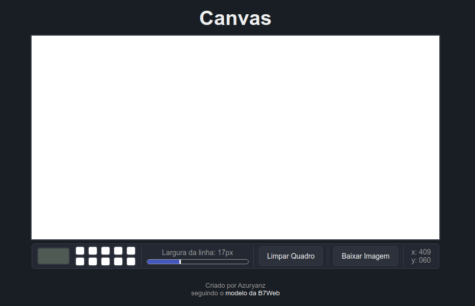
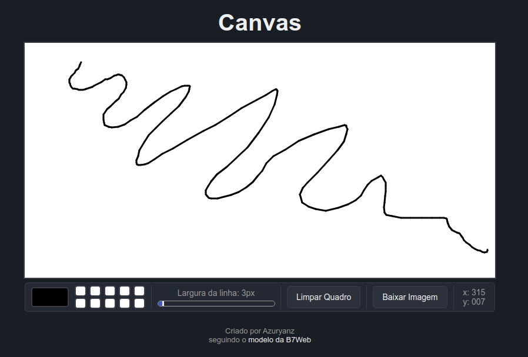
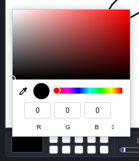
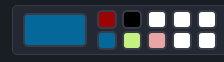
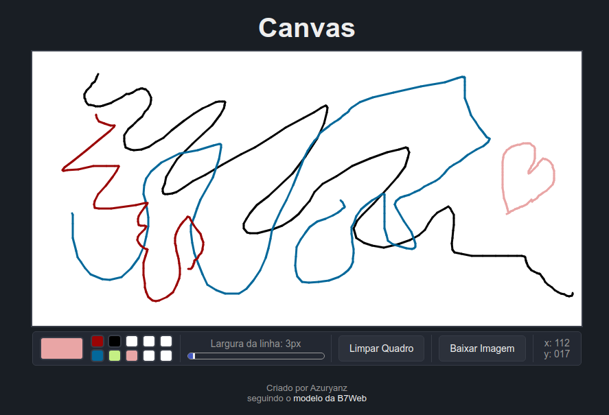
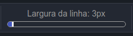
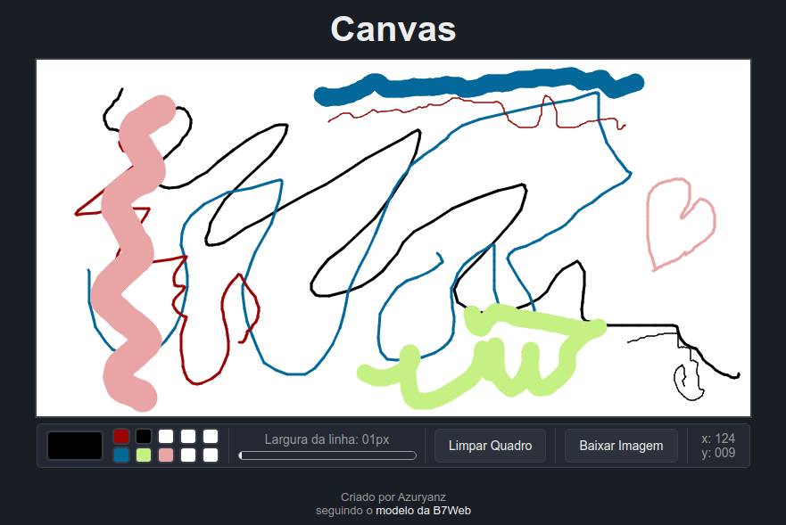
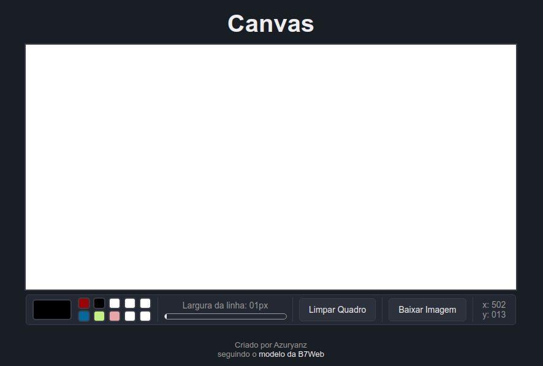
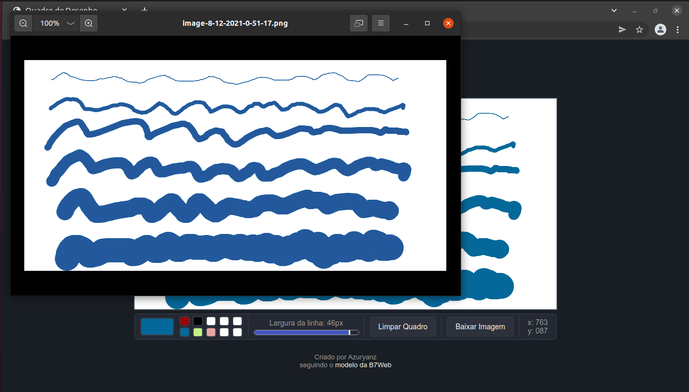

<h1 align="center">Canvas de Desenho</h1>

## Sobre o Projeto
O projeto original é de autoria da B7Web, e a vídeo-aula mostrando como desenvolver o projeto base pode ser encontrada [aqui](https://alunos.b7web.com.br/curso/javascript/d7js-projeto-5-quadro-de-desenho).

Todo o **HTML** e **CSS** foi desenvolvido por conta própria, apenas visualizando o layout e ideias iniciais do projeto original. No que diz respeito ao **JavaScript**, ele foi baseado no vídeo do projeto original. 
Em especial, a função utilizada para baixar arquivos pode ser encontrada [aqui](https://codepen.io/joseluisq/pen/mnkLu).

Assim, as diferenças deste projeto para aquele desenvolvido na vídeo-aula são:
- Campo para seleção de cores;
- Campos para salvar e carregar informação de cores;
- Barra que permite alterar a largura do traço no canvas;
- Diferança nna função de limpar a tela do canvas;
- Botão que permite baixar o arquivo do canvas;
- Display das coordenadas do mouse no canvas.

## Como utilizar

### Abrindo o arquivo
Uma vez que o projeto utiliza apenas de HTML, CSS e JavaScript, basta o usuário abrir o arquivo **index.html** em um navegador, que tela da bateria será carregada.

O termo **modelo de B7Web** é clicável, e redireciona para a vídeo-aula do projeto.

### Desenhando no canvas

Para desenhar no canvas, basta ao usuário **clicar e segurar** o **botão esquerdo** do mouse enquanto *estiver na aŕea do canvas*, e mover o mouse. Para parar de desenhar, basta **soltar** o respectivo botão do mouse.

### Escolhendo uma cor

Para alterar a cor da linha, o usuário deve clicar na área em destaque *(imagem acima)*, selecionar com o *mouse* ou inserir um código de cores *RGB, HSL ou Hex* nos desvidos campos da janela. Uma vez feito isso, basta **clicar fora** de tal janela ou **apertar a tecla enter**, que a cor será selecionada para o ponteiro utilizado no canvas.

Os 10 quadrados brancos ao lado do seletor podem ser usados para *salvar* e *carregar* informações de cores:
- Clicando com o **botão esquerdo** do mouse *carrega* a cor salva no quadrado clicado no ponteiro do canvas;
- Clicando com o **botão direito** do mouse *salva* a cor do ponteiro do canvas no quadrado clicado, mudando sua cor e salvando seu valor em *Hex*.

 

### Alterando a Largura da Linha

Para alterar este valor, basta ao usuário movimentar a barra de slider *(imagem acima)* para o valor que deseja. Tem-se que:
- A largura inicial é de 3px;
- A largura mínima é de 1px;
- A largura máxima é de 50px;

Uma vez alterado a barra em questão, o ponteiro no canvas desenhará com a largura indicada.

### Limpar o canvas

Para limpar a tela do canvas, basta o usuário **clicar** no botão *Limpar Quadro* na barra localizada abaixo do canvas.

É importante ressaltar que, além de limpar as linhas do canvas, este botão também **pinta** o canvas todo de *branco*. Essa escolha foi feita para que, ao se baixar a imagem do canvas, ela não tenha um fundo transparente.

### Baixando a imagem do canvas

Para **baixar** a imagem desenhada no canvas, basta o usuário clicar no botão **Baixar Imagem**.
- A imagem será baixada para a pasta de downloads do navegador utilizado;
- O nome do arquivo segue este formato: **image-dia-mês-ano-horas-minutos-segundos.png**.

### Coordenadas no canvas
A última informação na barra de ferramentas (abaixo do canvas) são as **coordenadas** do ponteiro do mouse no canvas.